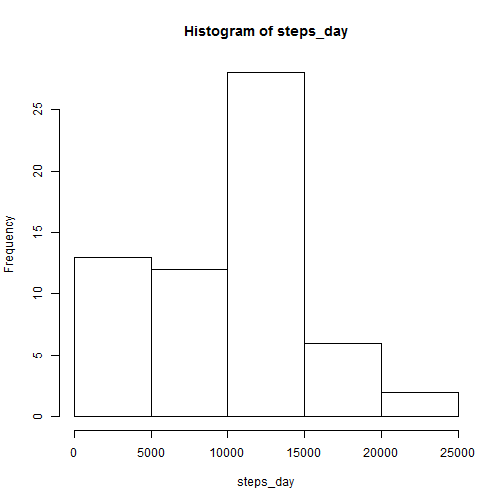
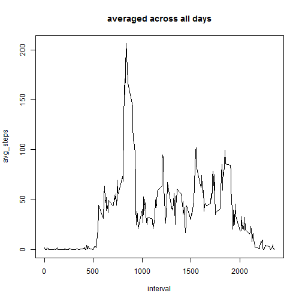
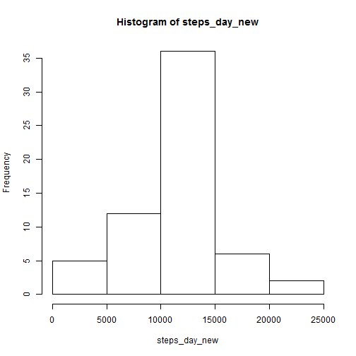
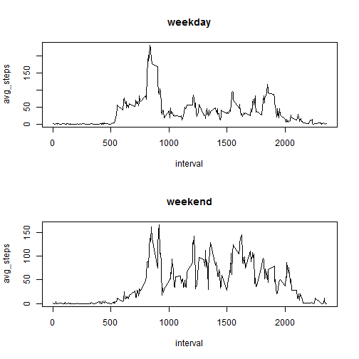

Introduction
========================================================
It is now possible to collect a large amount of data about personal movement using activity monitoring devices such as a Fitbit, Nike Fuelband, or Jawbone Up. These type of devices are part of the "quantified self" movement -- a group of enthusiasts who take measurements about themselves regularly to improve their health, to find patterns in their behavior, or because they are tech geeks. But these data remain under-utilized both because the raw data are hard to obtain and there is a lack of statistical methods and software for processing and interpreting the data.

This assignment makes use of data from a personal activity monitoring device. This device collects data at 5 minute intervals through out the day. The data consists of two months of data from an anonymous individual collected during the months of October and November, 2012 and include the number of steps taken in 5 minute intervals each day.

Data
========================================================
The variables included in this dataset are:

steps: Number of steps taking in a 5-minute interval (missing values are coded as NA)

date: The date on which the measurement was taken in YYYY-MM-DD format

interval: Identifier for the 5-minute interval in which measurement was taken

The dataset is stored in a comma-separated-value (CSV) file and there are a total of 17,568 observations in this dataset.
fig.width=7, fig.height=6

Loading and preprocessing the data
========================================================

```r
setwd("C:/Users/212341630/Desktop/cour_rep_res")
activity <- read.csv("activity.csv", header = TRUE)
```


set working directory to the location where activity.csv is present

Summary of mean total number of steps taken per day
========================================================

```r
steps_day <- tapply(activity$steps, activity$date, sum, na.rm = TRUE)
hist(steps_day)
```

 

```r
mean_steps_day <- mean(steps_day)
median_steps_day <- median(steps_day)
print(paste("mean of total number of steps per day ", round(mean_steps_day, 
    digits = 2), sep = "="))
```

```
## [1] "mean of total number of steps per day =9354.23"
```

```r
print(paste("median of total number of steps per day ", median_steps_day, sep = "="))
```

```
## [1] "median of total number of steps per day =10395"
```

Average daily activity pattern
========================================================

```r
steps_avg_interval <- tapply(activity$steps, activity$interval, mean, na.rm = TRUE)
plot(as.numeric(names(steps_avg_interval)), steps_avg_interval, type = "l", 
    xlab = "interval", ylab = "avg_steps", main = "averaged across all days")
```

 

```r
max_interval = as.numeric(names(steps_avg_interval)[which.max(steps_avg_interval)])
print(paste("interval with max number of stepds averaged across all days ", 
    max_interval, sep = "="))
```

```
## [1] "interval with max number of stepds averaged across all days =835"
```

Inputing missing values
========================================================

```r
tot_missing_val <- sum(is.na(activity$steps))
print(paste("Total number of missing values ", tot_missing_val, sep = "="))
```

```
## [1] "Total number of missing values =2304"
```

```r
activity_new <- activity

for (i in 1:nrow(activity)) {
    if (is.na(activity_new$steps[i])) {
        activity_new$steps[i] = steps_avg_interval[as.character(activity_new$interval[i])]
    }
}

steps_day_new <- tapply(activity_new$steps, activity_new$date, sum, na.rm = TRUE)
hist(steps_day_new)
```

 

```r
mean_steps_day_new <- mean(steps_day_new)
median_steps_day_new <- median(steps_day_new)
print(paste("new mean of total number of steps per day ", round(mean_steps_day_new, 
    digits = 2), sep = "="))
```

```
## [1] "new mean of total number of steps per day =10766.19"
```

```r
print(paste("new median of total number of steps per day ", round(median_steps_day_new, 
    digits = 2), sep = "="))
```

```
## [1] "new median of total number of steps per day =10766.19"
```

Yes the new mean and median values differ from the earlier. The new mean and median increased after inputing missing values as we have decreased Bias by updating the missing values

Activity patterns between weekdays and weekends
========================================================

```r
activity_new$weekday <- sapply(as.Date(activity_new$dat), weekdays)
for (i in 1:nrow(activity_new)) {
    if (activity_new$weekday[i] == "Sunday" | activity_new$weekday[i] == "Saturday") 
        activity_new$weekday[i] = "weekend" else activity_new$weekday[i] = "weekday"
}

activity_new_weekday <- subset(activity_new, activity_new$weekday == "weekday")
activity_new_weekend <- subset(activity_new, activity_new$weekday == "weekend")

steps_avg_interval_weekday <- tapply(activity_new_weekday$steps, activity_new_weekday$interval, 
    mean, na.rm = TRUE)
steps_avg_interval_weekend <- tapply(activity_new_weekend$steps, activity_new_weekend$interval, 
    mean, na.rm = TRUE)

par(mfrow = c(2, 1))
plot(as.numeric(names(steps_avg_interval_weekday)), steps_avg_interval_weekday, 
    type = "l", xlab = "interval", ylab = "avg_steps", main = "weekday")
plot(as.numeric(names(steps_avg_interval_weekend)), steps_avg_interval_weekend, 
    type = "l", xlab = "interval", ylab = "avg_steps", main = "weekend")
```

 

